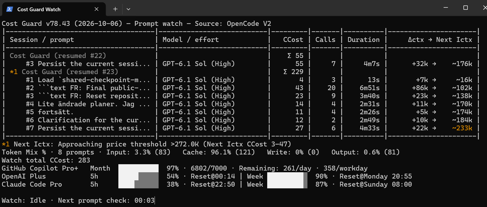
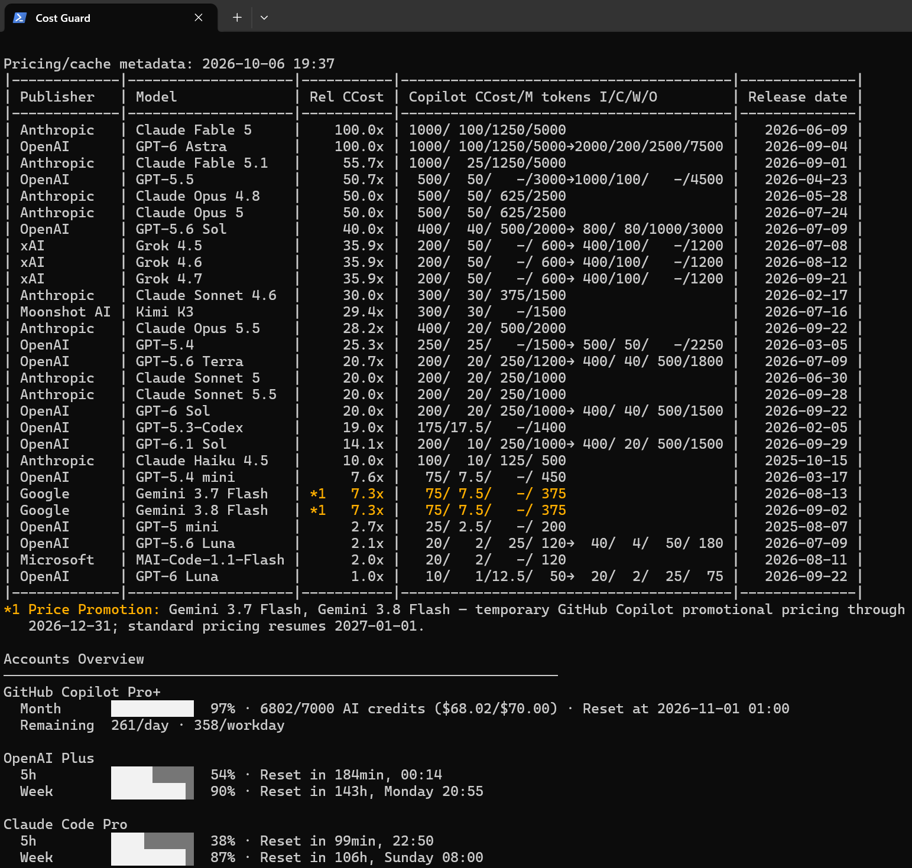
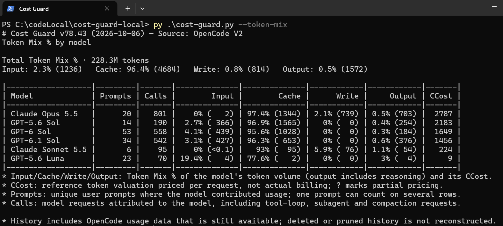

# Cost Guard

**Monitor AI model usage, cost and quotas in OpenCode.**

Cost Guard analyzes [OpenCode](https://opencode.ai/) prompts/sessions, relative model costs and account quotas locally, with real-time Watch.



Live OpenCode prompts/sessions: model/effort, CCost, calls, context development and account quotas.

## At a glance

- Monitor active OpenCode prompts and sessions in real time.
- Compare AI model costs; see CCost per prompt/session.
- Analyze Token Mix across input, cache read, cache write and output.
- Track context growth and causal usage, including subagents.
- Monitor account/subscription quotas across supported providers.
- Inspect available historical OpenCode sessions and prompts.
- Compare available AI models using your observed workload mix.

## Quick start

Cost Guard changes rapidly. Use **current `main`**: the latest supported Cost Guard code.

Without Git: [repository](https://github.com/qstoffe/cost-guard) → **main → Code → Download ZIP**. Extract with the folder structure intact; download again to update.

With Git:

```sh
git clone --branch main https://github.com/qstoffe/cost-guard.git
cd cost-guard
# Later, on main:
git pull --ff-only
```

Install **Python 3.11+**; standard supported OpenCode installations need no configuration.

### Windows

Double-click the `.cmd` launchers under `windows/`:

| Launcher | Mode |
| --- | --- |
| `Cost Guard.cmd` | Normal model comparison/account quota report. |
| `Cost Guard Watch.cmd` | Live/global Watch; Ctrl+C stops Watch only. |

Windows launchers reuse one persistent PowerShell console: completion, errors and Ctrl+C leave a usable prompt. See [download trust](#open-source-license-and-windows-download-trust).

### macOS

Equivalent launchers are under `macos/`:

| Launcher | Mode |
| --- | --- |
| `Cost Guard.command` | Normal report. |
| `Cost Guard Watch.command` | Live/global Watch; Ctrl+C exits. |

Prefer `git clone` on macOS: Git records launchers as executable. Source ZIPs carry executable metadata, but extraction tools may not preserve it. After extracting, run from the repository root:

```sh
chmod +x macos/*.command development/macos/*.command
```

Use Finder's **Open** for quarantine prompts.

For Python CLI commands, see [setup and usage](#setup-and-usage). Use `python3` on macOS or `py -3` on Windows if needed.

## Core concepts

### What Cost Guard counts

Distinct signals:

- **Usage:** observed model requests and input/cache/output/reasoning tokens.
- **CCost:** reference token valuation, not verified billing or credits deducted.
- **Billed:** actual monetary spend with reported or explicit subscription/zero-billing evidence; otherwise `N/A`.
- **Quotas / limits:** independent account-native windows, credits, budgets and availability.

CCost uses GitHub reference rates in Copilot AI-credit-equivalent units. Included subscription work can have positive CCost and Billed $0.00. Unknown prices stay unknown, never replaced with billed cost. A quota credential does **not** prove historical request-account attribution.

### Symbols and token categories

Token Mix uses **I/C/W/O** for uncached input/cache read/cache write/output (including reasoning). See the [usage and cost reference](docs/usage-and-cost.md) for exact counting, rounding, symbols and attribution caveats. Session detail is opt-in, not a billing ledger.

## Reports and usage analysis

### Model comparison and account overview

Normal-report excerpt: model pricing/comparison using your observed workload mix, plus account quotas.



Details: [normal report](#normal-report), [model comparison](#model-comparison), [account quotas](#account-quota-blocks).

### Token Mix

`--token-mix` breaks available historical usage down by model and input/cache-read/cache-write/output token category, together with CCost.



See [Token Mix reference](#token-mix--by-model---token-mix). Screenshots are illustrative and may show an earlier Cost Guard product version.

## Requirements

- Python **3.11 or newer**.
- A supported OpenCode installation/history:
  - **V1:** Cost Guard reads the local legacy OpenCode SQLite database directly in read-only/query-only mode.
  - **V2:** Read-only registered-service loopback HTTP. If unavailable, `auto`/`v2` may call `opencode api get /api/info` once (no Desktop/TUI); Watch retries process-free every five seconds. Diagnostics `--test-service-start` tests cold startup without stopping a shared service.
- Internet access for GitHub Copilot pricing/model metadata fetches.
- Optional Copilot quota reuses OpenCode OAuth in memory, without login, credential writes or GitHub CLI.
- Optional OpenAI subscription quota is fail-soft. Read-only V2 accounts take priority; legacy `auth.json` applies only without V2 rows. Credentials are never refreshed, rotated or written.
- Configured OpenAI/Anthropic API accounts are distinct from **Claude Code subscriptions**, discovered through the optional installed `claude` CLI. Cost Guard never reads/copies Claude credentials or attributes current login to history.
- Claude Code quotas use optional experimental SDK-control metadata (no prompts, transcript scans or new dependencies); accounts stay visible when quotas fail. See [Claude integration and limitations](development/claude-code.md).
- OpenRouter/DeepSeek accounts reuse configured OpenCode API keys through maintained read-only HTTPS endpoints. MiniMax Token Plan uses its dedicated subscription integration; generic API keys do not establish subscription entitlement.
- No third-party Python packages are required.

## Setup and usage

Check `python --version` is 3.11+. Full commands, from the repository root:

```text
python cost-guard.py                            # Available models + account quotas
python cost-guard.py --all-models               # Full pricing/model catalog only
python cost-guard.py --token-mix                # Total and per-model Token Mix %/CCost, all available history
python cost-guard.py --sessions 10              # Latest 10 available root sessions
python cost-guard.py --sessions all             # All available root sessions
python cost-guard.py --watch                    # Global Watch; Ctrl+C exits
python cost-guard.py <session-id>               # One session
python cost-guard.py <session-id> --watch       # Watch one session/root tree
python cost-guard.py 2026-08-24                 # One local calendar day
python cost-guard.py 2026-08-01:2026-08-31      # Inclusive local date range
python cost-guard.py --version
python cost-guard.py --help
```

See [Quick start](#quick-start) for launchers. Diagnostics ZIPs go under `diagnostics/`.

Cost Guard uses `config/default-config.jsonc`. Create optional `config/user-config.jsonc` beside it only for overrides.

## Open-source license and Windows download trust

Cost Guard uses **0BSD**: use, modify and redistribute, including commercially, without attribution. See `LICENSE`.

Windows source ZIPs use the same `.cmd` launchers; retain the folder structure. SmartScreen may warn about unsigned downloaded launchers. Verify the ZIP came from this repository's `main` before removing download marks from the extracted repository root:

```powershell
Get-ChildItem -Recurse | Unblock-File
```

No signing certificate ships.

## OpenCode V1/V2 source selection

The shipped default is:

```jsonc
{
  "openCode": {
    "source": "auto"
  }
}
```

`auto` selects **one** healthy source: V2 first, otherwise V1; histories are never merged. Force `v1`/`v2` only for troubleshooting or a legacy workflow.

With V2 selected, a metadata-only V1 check finds missing/newer legacy sessions. Reports note them only if they can affect the shown scope (latest-prompt sample, dates, session, all history); Watch never; Diagnostics always counts them. Nothing is repaired/written.

Reports show `OpenCode not found` only when selection fails and no PATH executable or standard installation evidence exists. Usable sources work without the CLI; Watch still waits/retries.

## Normal report

`python cost-guard.py` shows CCost/Token Mix %/Relative CCost definitions, models/notices and `Accounts Overview`. Token Mix covers up to 100 latest visible prompts with telemetry (including running/interrupted/child work): count, volume, shares and CCost. No monthly usage, prompt detail or graph is built.

### Model comparison

**Relative CCost** applies the latest-100 completed-prompt I/C/W/O mix to every tier against the cheapest comparable **base** (`1.0x`). Illustrative `8.0x → 16.0x (>200K)` means an increase above 200000 input tokens; `≥` is inclusive. Running/aborted prompts are excluded. Without samples, values stay blank; hidden 2/96/1/1 drives sorting only.

Availability uses settled V2 `/api/model` IDs (V1: `opencode models`), exact/verified aliases and explicit variant rates. Ambiguous prices stay unknown; failed lookups warn/show the catalog. Unpriced models have no row.

Both modes sort by full-Decimal base/higher price descending, earlier context boundary, then name alphabetically; repeat for later tiers. One-decimal display never controls order; unknown prices stay unknown.

**Faded rows** mean a newer recognized same-family/variant version is shown here, not official deprecation. Matching is conservative/numeric; selection, ordering and prices stay unchanged. See [model comparison](docs/usage-and-cost.md#model-comparison).

`--all-models` adds exact native **GitHub USD/M I/C/W/O**: all tiers/boundaries even without a mix, no availability/accounts. Normal reports have four columns:

| Column | Meaning |
| --- | --- |
| `Publisher` | Model creator/group. |
| `Model` | Model display name. |
| `Relative CCost` | Shared-reference tier multipliers: markers left, multipliers right, reserved arrows/threshold fields. |
| `Release date` | Public model release date when confidently available. Recently released models are highlighted/notified. |

✦ New Models lasts seven UTC days after release (Watch: or after a verified catalog addition when no date exists; never invented); report promotion markers last through validity. Watch promotion notices need a proven start within seven days. Only notice labels are colored.

## Token Mix % by model: `--token-mix`

Scans all available OpenCode history; the first uncached run can be slow. `Total Token Mix % · <volume> tokens` comes first, recomputed from shown requests. Each historically used, currently selectable model has `Prompts`, `Calls`, aligned Input/Cache/Write/Output shares and CCost, and total `CCost`.

- `Prompts`: unique user prompts where the model contributed usage. One prompt can count on several model rows, so rows do not sum to a prompt total.
- `Calls`: model requests attributed to the model, including tool-loop continuations, subagent and compaction requests. Compare both to judge sample size.
- Deleted or pruned history is not reconstructed; no private ledger exists. Rows never imply which account or subscription served a model.
- If current model availability cannot be established, all historically used models are shown with a warning (fail open).

Interactive progress is transient; redirected output uses stage lines.

## Available sessions: `--sessions N|all`

Shows only a session table and its legend, newest causal-tree activity first, not cost order. `N` is a positive maximum; an oversized limit or `all` shows all available root sessions, including available archived sessions. Descendants belong to their root rather than appearing as duplicate detail targets. No aggregate Total row is shown.

| Column | Meaning |
| --- | --- |
| `Session id` | OpenCode root-session ID. |
| `Name` | Session title. |
| `Model` | Primary model by attributed CCost; trailing `*` means another model also contributed. |
| `CCost` | Reference valuation for the entire available session, across day/month boundaries; not billing. |
| `#` | Relevant visible prompts across the entire session; compactions remain distinct detail events, not user prompts. |

## Session and date detail reports

Passing a session ID shows only that session/root's prompt analysis and explanations. Explicit date/date-range modes use the same table against their selected scope, limited to data still available from OpenCode. Neither fetches model availability or account quotas.

| Column | Meaning |
| --- | --- |
| `Prompt` | Local time, prompt number and preview. Separate `Model:` and `[ABORTED]` timeline rows provide history context. `/compact` is shown as its own event. |
| `CCost` | Reference token valuation of the prompt/event, independent of billing; `?` marks a partial subtotal. |
| `Calls` | Completed causal model requests belonging to the prompt/event. |
| `~Ictx` | Incoming context or `Δctx -> Next Ictx` when the chronological context state is available. |
| `~Ictx CCost` | Incoming-context reference valuation, not billing. |
| `~Extra CCost` | Additional causal usage reference valuation beyond incoming context, not billing. |
| `I/C/W/O %` | Token-category mix, or running-state text while a prompt is still active. |

Known causal splits show **Main / Subagents / Total**; running prompts may show `running - consider ABORT`. `(Next Ictx CCost 0.3–3)` is the next input context's cached–fresh CCost range, not a cache-hit prediction. Threshold markers/indicators share amber `nextIctxWarning`: approaching highlights the marker; exceeded the full explanation.

Moving a session (e.g. to a worktree) keeps its ID and never re-counts history; V2 reads messages by session ID. The non-billable move starts a new context epoch: Next Ictx is N/A until the first request after it sets the new baseline.

A one-shot session report automatically follows an already-running latest prompt until that prompt completes or aborts.

Persisted V2 terminal evidence ends the matching attempt (duration freezes) and keeps failure/cancellation/success distinct; inactivity or disconnection alone proves no end, and usage/cost is unchanged.

## Account quota blocks

Only detected/configured accounts appear, retaining source-aware identities. Upstream labels or neutral ordinals distinguish same-provider rows; Personal/Work labels are never invented.

Shared read-only discovery skips absent providers. Four quota workers overlap analysis; final waiting is capped at 15s, never inventing capacity. See [acquisition contracts](docs/account-support.md#credentials-refresh-and-troubleshooting).

Accounts share aligned 10-cell remaining bars, native values, resets and narrow fallback. Bars require real provider-reported capacity (a denominator or explicit percentage); balance/spend alone stays textual and is never CCost.

**OpenRouter** shows authenticated-key Day/Week/Month spend and genuine key limits; **DeepSeek** shows separate native balances without a fabricated bar; **MiniMax Token Plan** supports native subscription windows, not entitlement inferred from a generic key. See [account support](docs/account-support.md) for all providers, Copilot Remaining/overage semantics, alignment, resets and limitations.

## Watch

Watch shares report analysis and groups sessions by latest activity (oldest first; session-ID ties). `watchDashboardMaxRows` (default 14) limits retained/displayed prompts only; active/recent rows stay protected, so it is not a hard maximum. Prompt/compaction order is preserved.

Watch's first view never waits for quotas. Accounts arrive individually on the main thread; normal refresh discovers account changes without reparsing unchanged sources. Identity/recovery rules and late-reply protection remain.

| Column | Meaning |
| --- | --- |
| `Session / prompt` | Session grouping plus prompt/event rows. Running prompts show tool counts (`8× read · 3× other · 2 failed`) and, for a ≥10 s tool, background job or open TODO, `running: bash 34s · background: shell 2m · TODO 2/4 done · text`. Arrows align with `#`; failures stay red. |
| `Model / effort` | Same as report: explicit/request-proven effort, otherwise `(Default)` for a known normal request. No model-family default guesses or `Default -> X`. Compaction shows only its own explicit effort. |
| `CCost` | Current observed prompt/event reference valuation, not billing. |
| `Calls` | Completed causal model requests. |
| `Duration` | Wall-clock duration; a prompt stays running (footer `background shell`) while its verified background job runs. |
| `Δctx -> Next Ictx` | Context-state change and next context when available. |

Session `Σ` sums its displayed prompt/event CCost before rounding, preserving `?`/`N/A`. Native non-billable compactions contribute zero with blank row cost. Rounded row strings need not sum to the subtotal.

`Token Mix % · N prompts` shows run-scoped unique prompts, shares and CCost without volume/bar. Startup-running requests, between-poll completions, child work and compactions qualify; completed pre-Watch history does not. `Watch total CCost` sums qualifying usage (zero when none), unchanged by eviction/disappearance, resync or moves. It may differ from `Σ`: mid-prompt startup can show `Σ 78`, row `78`, run total `59`; eviction changes only row subtotals.

Any account count uses compact rows when they fit, otherwise individual wrapped blocks. Resets use `Reset@...`; fixed quotas with Remaining omit duplicate compact reset text, retained in reports/narrow fallback:

```text
GitHub Copilot Pro+   Month  ██████████ 100% · 7000/7000 · Remaining: 259/day · 350/workday
OpenAI Plus          5h     ████████░░  82% · Reset@22:49 | Week ██████████  98% · Reset@Sunday 07:59
```

`Watch:` stays last. Interactive startup uses `Cost Guard vX.Y (YYYY-MM-DD) — <Mode>` with progress immediately below, no blank row. Transient UI disappears before final reports/Watch dashboards; redirected output remains plain, without animation.

Aborted labels persist after red emphasis expires. Quota errors retain values for five minutes; scheduling gaps/first startup errors allow 60s `STALE / RECONNECTING` recovery with 5/10/20s retries. Auth rejection remains visible.

Full redraws clear screen/scrollback; countdowns replace only the status line. V1 Watch uses process-free SQLite gating; V2 events are hints with a five-second cooldown and authoritative resync. `"auto"` refresh adapts within 5–30 seconds; quota refresh is independently rate-limited.

**Watch troubleshooting.** OpenCode outages keep the last dashboard with `Watch: OpenCode V2 source unavailable · retrying every 5s`; retries use the same source, no V1 fallback/CLI start, then resume from a fresh snapshot. Unsupported schemas or data unreadable for about a minute end Watch with an error. Runtime failures exit non-zero; missing/archived session targets stop normally. Windows returns to PowerShell. Closing/killing the terminal still ends Watch.

## Pricing, quota and network behavior

Watch checks Copilot hourly; 15-minute V2 checks trigger early refresh only for newly observed IDs. ✦ New Models requires verified priced models; CCost stays pinned. Independent release-date recovery uses models.dev/changelog, ~1/5/15-minute then hourly retries, respecting 429 and retaining verified dates. Expired promotions revert to verified rates or are withheld.

Quota credentials stay memory-only: V2 precedes legacy, explicit `authJsonPath` is file-only, inactive accounts never change login. No replacement credentials or other-installation search; OpenAI/Claude remain version-sensitive/fail-soft.

## Configuration

`config/default-config.jsonc` owns defaults, thresholds and colors. Optional `config/user-config.jsonc` recursively overrides defaults and never ships.

Useful settings include:

- `runningPromptWarningCCost`: warn for a running prompt at 1800 CCost by default (0 disables). Obsolete `runningPromptWarningUsd`/`thresholds.watchCostDeltaDisplayUsd` (removed in v78.36) fail startup as unrecognized; delete them.

- `openCode.source`: `auto`, `v1` or `v2`.
- `timezone`: local day/timestamp zone. The shipped `Europe/Stockholm` default works without an external tzdata package; other custom IANA zones require host/Python zoneinfo data.
- `workdayCalendar`: `SE` for Swedish weekends/public holidays, or empty for weekends only.
- `copilotQuota.enabled` / `authJsonPath`: optional account lookup controls.
- `openAiQuota.enabled` / `authJsonPath`: fail-soft OpenAI ChatGPT/Codex usage lookup controls.
- `anthropicQuota.enabled`: Anthropic API and Claude CLI account lookup; `authJsonPath` overrides only the API-account inventory.
- `openrouterQuota`, `deepseekQuota`, `minimaxQuota`: `enabled` / `authJsonPath` only; maintained endpoints and mappings cannot be customized.
- `sessionWatchIntervalSeconds`: `"auto"` (default, adaptive 5–30 seconds) or an explicit compatible integer.
- `pricingMaxAgeHours`: pricing/model metadata cache age.
- `thresholds`: running-cost, context, percentile and quota warning thresholds.
- `colorScheme`, `colorSchemes`, `colors`: terminal palette selection and per-role overrides.

`modelComparisonNew` colors new names/dates/notice labels; `modelComparisonPromotion` colors active rates/Relative CCost/notice labels. Classic: lime 118/gold 214; light: green 28/ochre 130. Definition roles use Yellow; release date stays last.

Superseded cells fade their resolved/custom hues in dark/light themes. Gold stays gold; borders/plain output/width stay unchanged, with no new settings.

Invalid configuration fails at startup; legacy `monthlyAiCredits` is ignored.

## Cache and concurrent Cost Guard processes

Runtime acceleration state is created under:

```text
cache/
  cost-guard-cache-v2.sqlite3
```

The cache is disposable. Stop Cost Guard before deleting `cache/`; the next run rebuilds it. Breaking schemas use a new generation filename, never migration/deletion of an in-use database.

SQLite WAL, short transactions and bounded waits support concurrent report/global/session Watch.

## Diagnostics for environment-specific problems

For troubleshooting, use `Cost Guard Diagnostics` under `development/windows/` or `development/macos/`, or run from the repository root:

```text
python development/tools/collect_diagnostics.py
```

Creates `diagnostics/cost-guard-diagnostics.zip`: **Full/local** tests, package validation (including failures), environment, source statistics, timings, provider/metadata health and classified errors. The final screen shows result/path/support address. `--no-network` skips pricing/quotas; `--skip-validation` is emergency/recursive-only.

Bundles omit prompts, titles, raw payloads/auth, tokens and account labels/IDs; source IDs are hashed. Sanitized account evidence covers discovery/category, plan/status, numeric shape, HTTP/schema outcomes, component/malformed counts and acquisition timings. Inventory is available without live accounts.

### Internal software faults

**`COST GUARD FAILED`** means an unexpected software fault: non-zero exit, an error log under `logs/errors/` and a report under `logs/crashes/`. It and other stopping errors end with the Diagnostics launcher path to run; nothing starts automatically. Isolated faults show ERROR while safe results continue. [Error diagnostics](docs/runtime-errors.md) explains privacy, 30-day retention and reporting fallback.

## Current version

**v80.23** fixes fading of superseded xAI/Grok models. v80.0 is the Python 3.11+ public baseline. Claude quotas remain experimental; coverage/restart/sleep need separate live evidence.

Product versions identify code state; they do not imply a Git tag, release ZIP or GitHub Release. Packaged GitHub Releases are currently paused. Recommending them at a slower/stable cadence requires an explicit policy change; version numbers never trigger it automatically.

## Development

`AGENTS.md` routes maintainers to `development/`. Verify the working tree, not ZIPs. Never commit or push automatically.

```text
python development/tools/run_tests.py --suite quick
python development/tools/validate_package.py --working-tree
python development/tools/run_tests.py --suite full
python development/tools/collect_diagnostics.py
```

`development/tools/build_release.py` is for [explicitly requested packaging only](development/MAINTAINER.md#explicit-packaging-procedure); ZIPs go to git-ignored `releases/`.
